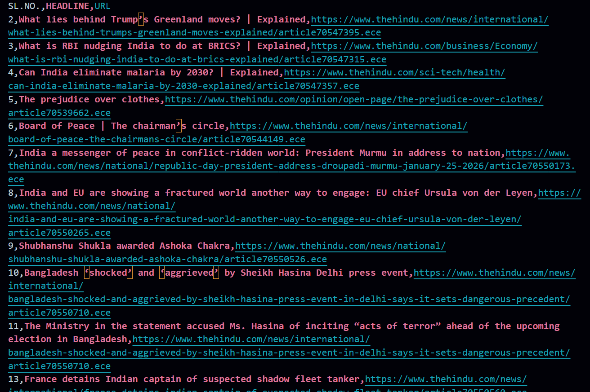

# 📰 The Hindu News Article Scraper using Selenium (Python)

## 📌 Project Overview
This project is a **web automation and data extraction project** built using **Selenium in Python**.  
The script automatically visits **The Hindu news website**, extracts article information, and stores the data into a **CSV file** for further use.

The extracted data includes:
- Serial Number (SL No)
- Article Headline
- Article URL (Link)

This project focuses on **real-world web scraping**, automation logic, and structured data storage.

---

## ⚙️ Technologies Used
- **Python**
- **Selenium WebDriver**
- **Google Chrome**
- **ChromeDriver**
- **CSV Module**
- **VS Code**

---

## 🚀 Features
- Automatically opens *The Hindu* news website
- Fetches multiple news article links
- Extracts article headlines and URLs
- Stores data in a structured **CSV file**
- CSV file contains:
  - SL No
  - Headline
  - URL
- Fully automated scraping process

---

## 🧠 Project Workflow
1. Launch Google Chrome using Selenium WebDriver  
2. Open **The Hindu** official news website  
3. Locate article elements using **XPath**  
4. Extract:
   - Article headlines
   - Corresponding URLs  
5. Generate a CSV file  
6. Save extracted data in the following format:
   - SL No | Headline | URL  

---

## 📊 Output Format (CSV)
The generated CSV file contains the following columns:

| SL No | Headline | URL |
|------|----------|-----|
| 1 | Sample News Title | https://www.thehindu.com/... |

---

## 🖼️ Project Snapshot


---

the-hindu-news-scraper/
│
├── csv_extract.py
├── HINDU.csv
├── csv_snapshot.png
└── README.md

---

▶️ How to Run the Project  

1️⃣ Clone the repository

```bash
git clone https://github.com/ashish-modak-22/csv_file_extraction.git
```
---

2️⃣ Install required libraries

---> pip install selenium

---

3️⃣ Run the script

---> python csv_extract.py

---

📌 Requirements

* Python 3.x
* Google Chrome browser
* ChromeDriver (matching Chrome version)
* Selenium library

---

🎯 Learning Outcomes

* Hands-on experience with real-world web scraping
* Learned to extract text and attributes using XPath
* Learned CSV file handling in Python
* Improved understanding of Selenium automation workflow
* Understood dynamic website scraping challenges

---

👨‍💻 Author

* Ashish Modak
* Selenium Automation Learner | Python Programmer | C/C++ DSA Enthusiast

---
